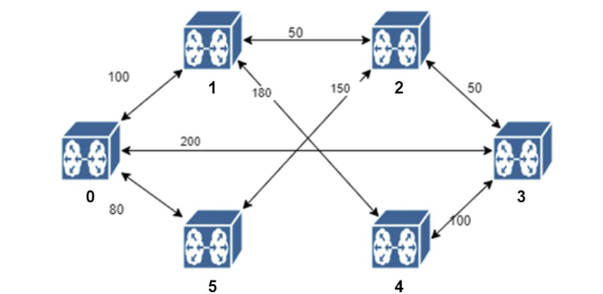

# Project I: Building a simple software defined network (SDN)

**IMPORTANT:** This is just a md form of the file `Lab_project_1.docx`.

## Project Overview
In contrast to traditional computer networks which employ distributed routing algorithms, there is growing interest in a new way of designing networks, which is referred to as Software Defined Networks (SDN). An SDN network consists of multiple SDN switches and a centralized SDN controller. Unlike traditional networks, SDN switches do not run distributed protocols for route computation. Instead, the SDN controller keeps track of the entire network topology, and all routing decisions (path computations) are made in a centralized fashion. Routing tables computed by the controller are then shipped to the switches.


In this project, you will implement a highly simplified SDN system comprising a set of switches and a controller implemented as user level python processes. The processes mimic the switches and controller, bind to distinct UDP ports, and communicate using UDP sockets. The project will (i) expose you to the concept of an SDN network; (ii) improve your understanding of routing algorithms; and (iii) give you experience with socket programming.


A key part of the problem is ensuring the controller has an up-to-date view of the topology despite node and link failures. To detect switch and link failures, periodic messages are exchanged between the switches, as well as between each switch and the controller as will be described in the document. The controller runs algorithms for path computation each time that the topology changes, and ships the latest routing table to each switch.


The routing algorithm used by the controller to compute paths is Dijkstra’s shortest path algorithm. Specifically, of all possible paths between the source and destination, the path with the shortest “distance” is chosen. The distance of a path is the sum of all the links’ distances on the path.

## Project Description
The switches and the controller emulate a topology specified in a topology configuration file. We begin by describing the format of the configuration file, next discuss the bootstrap process (the action performed by each switch process at the start of execution), path computation (how the controller computes routing tables), and the periodic actions that must be continually performed by the switch and the controller.

### Topology configuration file
When contacted by a switch, the controller will assign neighbors based on information present in a configuration file. The configuration file must provide a list of ids of neighboring switches for each switch id. The first line of each file is the number of switches.

Every subsequent line is of the form:
`<switch-ID 1> <switch-ID 2> Distance`

This indicates that there is a link connecting switch 1 and switch 2, which has a distance specified.

Consider the switch topology given in Figure 1. Please note that the switch id starts from 0 instead of 1.



*Figure 1:* 6 switch topology. Each link is marked with its distance.

Here is an example configuration for the topology shown.

```
6
0 1 100
0 3 200
0 5 80
1 2 50
1 4 180
2 3 50
2 5 150
3 4 100
```

### Bootstrap process
The bootstrap process refers to how switches register with the controller, as well as learn about each other.

**Note:** The bootstrap process must also enable the controller process, and each of the switch processes, to learn each other’s host/port information (hostname and UDP port number information), so communication using socket programming is feasible.

1. The controller and switch processes are provided with information using command line arguments (we require the command line arguments follow a required format discussed under ‘Running your Code and Important Requirements’)
    1. The controller process binds to a well-known port number
    2. Each switch process is provided with its own id, as well as the hostname and port number, that the controller process runs on, as command line arguments.


2. When a switch (for instance, with ID = 4) joins the system, it contacts the controller with a Register Request, along with its id. The controller learns the host/port information of the switch from this message.


3. Once all switches have registered, the controller responds with a Register Response message to each switch which includes the following information
    1. The id of each neighboring switch
    2. a flag indicating whether the neighbor is alive or not (initially, all switches are alive)
    3. for each live switch, the host/port information of that switch process.

### Path computations
Once all switches have registered, the controller computes paths between each source-destination pair using the shortest path algorithm.

Once path computation is completed, the controller sends each switch its “routing table” using a Route Update message. This table sent to switch A includes an entry for every switch (including switch A itself), and the next hop to reach every destination. The self-entry is indicated by an zero (=0) distance. If a switch can’t be reached from the current switch, then the next hop is set to -1 and the distance is set to 9999.

Shortest path example
In the topology example from figure 1, let us consider finding the best path between source switch 1 and destination switch 2. We can observe that the shortest path is 50, which is the link that directly connects switch 1 and 2. Dijkstra algorithm is a good fit for calculating shorting paths.

### Periodic Operations
Each switch and the controller must perform a set of operations at regular intervals to ensure smooth working of the network.

#### Switch Operations
1. Each switch sends a Keep Alive message every K seconds to each of the neighboring switches that it thinks is ‘alive’.
2. Each switch sends a Topology Update message to the controller every K seconds. The Topology Update message includes a set of ‘live’ neighbors of that switch.
3. If a switch A has not received a Keep Alive message from a neighboring switch B for TIMEOUT seconds, then switch A declares the link connecting it to switch B as down. Immediately, it sends a Topology Update message to the controller sending the controller its updated view of the list of ‘live’ neighbors.
4. Once a switch A receives a Keep Alive message from a neighboring switch B that it previously considered unreachable, it immediately marks that neighbor alive, updates the host/port information of the switch if needed, and sends a Topology Update to the controller indicating its revised list of ’live’ neighbors.

**IMPORTANT:** To be compatible with the auto-grader, we require that you use particular values of K and TIMEOUT as mentioned under the “Running your Code and Important Requirements” section.

#### Controller Operations
1. If the controller does not receive a Topology Update message from a switch for TIMEOUT seconds, then it considers that switch ‘dead’, and updates its topology.
2. If a controller receives a Register Request message from a switch it previously considered as ‘dead’, then it responds appropriately and marks it as ‘alive’.
3. If a controller receives a Topology Update message from a switch that indicates a neighbor is no longer reachable, then the controller updates its topology to reflect that link as unusable.
4. When a controller detects a change in the topology, it performs a recomputation of paths using the shortest path algorithm described above. It then sends a Route Update message to all switches as described previously.

### Mechanism to handle concurrency
As described above, a switch process has to concurrently perform two functions - either act on the messages received from neighbors/controller or wait for every ‘K’ seconds to send Keep Alive and Topology Update messages and check for dead neighbor switches. Similarly the controller has to receive Topology Update from the switches, but also periodically check whether any switch has failed.

To implement the concurrency, we require you to use Threads (See Threading Library in Python).

## Simulating Failure
Since we are running switches as processes, it is unlikely to fail due to natural network issues. Therefore, to allow testing and grading your submission we require the following to be implemented.

### Simulating switch failure
To simulate switch failure, you just need to kill the process corresponding to the switch. Restarting the process with the same switch id ensures you can simulate a switch rejoining the network.

### Simulating link failure
Simulating link failures is a bit more involved. We ask that you implement your switch with a command line parameter that indicates a link has failed.

For instance, let us say the command to start a switch in its normal mode is as follows:
switch <switch-ID> <controller hostname> <controller port>


Then, make sure your code can support the following parameter below:
switch <switchID> <controller hostname> <controller port> -f <neighbor ID>


This says that the switch must run as usual, but the link to neighborID failed. In this failure mode, the switch should not send KEEP_ALIVE messages to a neighboring switch with ID neighborID, and should not process any KEEP_ALIVE messages from the neighboring switch with ID neighborID.

## Logging
We REQUIRE that your switch and controller processes must log messages in a format exactly matching what the auto-grader requires. The logfile names must also match what the auto-grader expects. No additional messages should be printed.

To help you with generating the right format for the logs, in the starter code, we have created a starter version of controller.py and switch.py for you. Those two files contain various log functions that you must use. Each log function corresponds to a type of log message that will be explained below. We strongly recommend that you use those functions because the auto-grader is quite picky about exact log formats. If you choose not to use those functions, we won’t be able to award credit for test cases that fail owing to minor logging discrepancies.

### Switch Process
Switch Process must log

1. when a Register Request is sent,
2. when the Register Response is received,
3. when any neighboring switches are considered unreachable,
4. when a previously unreachable switch is now reachable
5. The switch must also log the routing table that it gets from the controller each time that the table is updated.

### Log File name
This must be `switch<Switch-ID>.log`

E.g., For Switch (ID = 4)
switch4.log

#### Format for Switch Logs
Format for each type of log messages is shown in comments beside their corresponding log functions. Please refer to the starter code.

### Controller Process
The Controller process must log

1. When a Register Request is received,
2. When all the Register Responses are sent (send one register response to each switch),
3. When it detects a change in topology (a switch or a link is down or up),
4. Whenever it recomputes (or computes for the first time) the routes.

#### Format for Controller Logs
Format for each type of log messages is shown in comments beside their corresponding log functions. Please refer to the starter code.

#### Controller Log File name
This must be Controller.log

**Note:** To reduce log output, please do not print messages when Keep Alive messages are sent or received. We also do not have log function for this.
Sample logs are available with the starter code. The sample log file is the situation where Config/graph_3.txt is used. Therefore, you will find one controller log file Controller.log and three switch log files switch0.log, switch1.log, and switch2.log. After all the switches know the initial topology, switch 1 is killed, and a new topology is calculated by the controller and sent out to the switches.

### Running your code and Important Requirements
We must be able to run the Controller and Switch python files by running:
python controller.py [controller port] [config file]
python switch.py <switchID> <controller hostname> <controller port> -f <neighbor ID>

The Controller should be executed first in a separate terminal. While it is running each switch should be launched in a separate terminal with the Switch ID, Controller hostname and the port.

#### Important Requirements:
To be compatible with the auto-grader, the following are mandatory requirements:

1. You must support command line arguments in the above format. Note that the “-f” flag for the switch is a parameter for link failures (See ‘Simulating Link Failure’), and we must be able to run your code with and without this flag.
2. Please use K = 2; TIMEOUT = 3* K (recall these parameters pertain to timers related to Periodic operations of the switch and the Controller)

As mentioned earlier, you are strongly recommended to use the logging functions that we provide.

### What you need to submit
Submit only controller.py and switch.py to Gradescope.


## Grading
Grading will be based on the test configurations provided with the starter code and some hidden tests. Make sure your code is able to handle all failure and restart scenarios for full points.

### Suggested Formats for Message Passing
While you are not required to follow this format, you may find it useful to follow the format below for messages exchanged between the switches and the controller, which we recommend.

#### Format for Register Request
`<Switch-ID> Register_Request`

Eg. Switch (ID = 3) sends the following Register Request to the controller when it first comes online.
3 Register_Request

#### Format for Register Response
`<number-of-neighbors>`
`<neighbor id> <neigh_hostname> <neigh_port>` (for each neighbor)


Eg. Consider the 6-switch topology given in Figure 1..

Switch (ID = 3) receives the following Register Response from the controller:

```
3
0 <hostname for switch 0> <port for switch 0>
2 <hostname for switch 2> <port for switch 2>
4 <hostname for switch 4> <port for switch 4>
```

#### Format for Route Update
`<Switch-ID>`
`<Dest Id> <Next Hop to reach Dest> (for all switches in the network)`


Next hop is returned as ‘-1’ if the destination can’t be reached by the switch via any possible path.

Eg. Consider the 6-switch topology given in Figure 1.

Switch (ID = 3) receives the following Route Update from the controller (Initially):

```
3
0 0
1 2
2 2
3 3
4 4
5 2
```

#### Format for Keep Alive Message
`<Switch-ID> KEEP_ALIVE`

Eg. Switch (ID = 3) sends the following Keep Alive to all of its neighboring switches:
3 KEEP_ALIVE

#### Format for Topology Update Message
`<Switch-ID>`
`<Neighbor Id> <True/False indicating whether the neighbor is alive>` (for all neighbors)

Eg. Consider the 6-switch topology given in Figure 1.

Switch (ID = 3) sends the following Route Update to the controller (Initially):

```
4
0 True
2 True
4 True
```